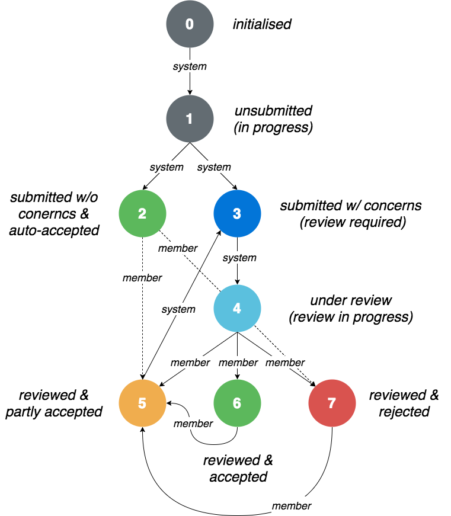
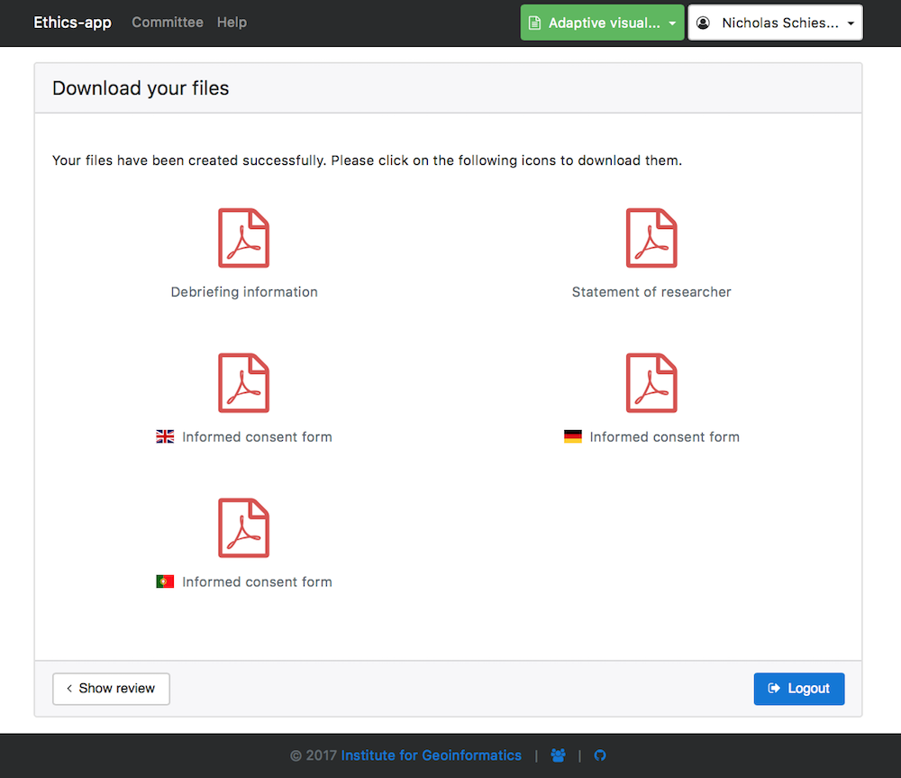
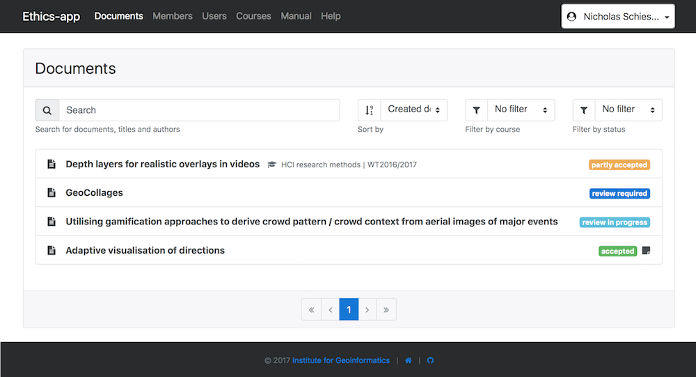
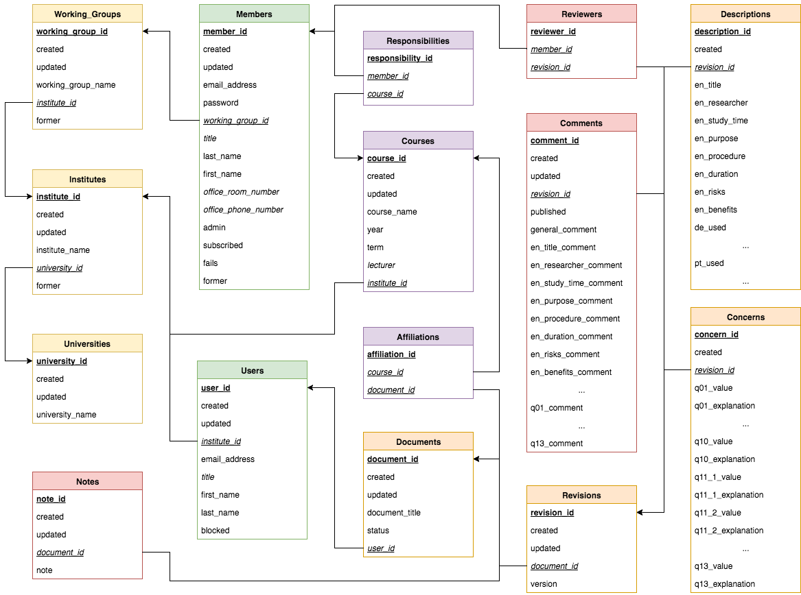

# Ethics-app

Ethics-application for the approval of user-studies

### Background

The Ethics-app is an implementation of the research paper by:

[Marc Langheinrich, Albrecht Schmidt, Nigel Davies, and Rui José. 2013. A practical framework for ethics: the PD-net approach to supporting ethics compliance in public display studies. In Proceedings of the 2nd ACM International Symposium on Pervasive Displays (PerDis '13). ACM, New York, NY, USA, 139-143. DOI=http://dx.doi.org/10.1145/2491568.2491598](http://dx.doi.org/10.1145/2491568.2491598)

The Ethics-app is used by the Institute for Geoinformatics, Münster for the approval of user-studies. Students and researchers can create documents for their projects and studies, which are reviewed by an Ethics committee. If an user-study contains ethical concerns, e.g. a participant will be recorded by camera or audio during the study, the researcher or student has to specify, why this is a requirement for the study. After the Ethics committee has accept the researchers request, the researcher can download the following PDF-files for the study, which are automatically generated on the server:

1. **The Informed Consent form**: This is the most important document. It assures that the participant gave his consent prior to participating in the study. Both you and your participant must sign the document, and you need to store your copy safely. Conducting a study without the written consent of the participant is not advised and can lead to various legal issues.

2. **The Statement of the Researcher**: The Statement of the Researcher provides guidelines for carrying out the study itself. You need to sign the Statement and store it safely together with the Informed Consent forms. This form is only for yourself and should not be handed to the participant.

3. **Debriefing Information**: The Debriefing Information provides a checklist for the debriefing after the experiment. It does not need to be signed as it only serves as a reminder of the most important points that should be mentioned during the debriefing. This list is not complete and needs to be extended based on the specific circumstances of the individual study.

### Reviewing process (document states)

The following flow chart shows the reviewing process of a document.



* `0`: First a document has been created by a researcher
* `1`: The researcher is filling out the forms
* `2`: The researcher has submitted the forms and no ethical concerns have been found in the user-study. The system accepted the researcher's request automatically. The researcher is able to download the PDF-files for his/her user-study. The PDF-files are generated automatically on the server-side and filled out with the data the researcher provided in the forms.
* `3`: The researcher has submitted the forms, but ethical concerns have been found. An email has been sent to the Ethics committee as a request to review the document
* `4`: A committee member has started to review the document and an email has been sent to the researcher about the status update
* `5`: The committee member has published the review and an email has been sent to the researcher about the status update. But the researcher needs to revise the document and has to submit it again.
* `6`: The committee member has published the review and an email has been sent to the researcher about the status update. The request has been accepted and the researcher is able to download the PDF-files for his/her user-study. The PDF-files are generated automatically on the server-side and filled out with the data the researcher provided in the forms.
* `7`: The committee member has published the review and an email has been sent to the researcher about the status update. The request has been rejected, so that the researcher is no longer able to access his/her document. This option is used, when a researcher clearly violated the app-guidelines.

The status of the document can be updated by only 2 options: the *system* in the background or a Committee *member* after reviewing.


### Architecture

The Ethics-app can be divided into 3 parts:

1. the **user-client** (Web-UI to create documents)
2. the **member-client** (Web-UI to review documents)
3. the **server** (hosting both clients, serving an API, processing documents and generating PDF-files for downloading)

#### 1. User client

This screenshot shows the successfully reviewed document of a researcher. Due it was accepted, the researcher is able now to download all PDF-files for his/her user-study:



### 2. Member client

This screenshot shows the committee board with all documents and their different states. Documents with the status `3` need to be reviewed with the status `4` are already in progress:



### 3. Database schema



***

## Installation

### 1. Database

##### 1.1. Postgres

* Go to [https://www.postgresql.org](https://www.postgresql.org) and download the latest version of Postgres.
* If you are on Ubunutu you can use the following commands

```
sudo apt-get install postgresql postgresql-contrib
sudo -i -u postgres

```

* If you are on macOS you can alternatively use Homebrew ([http://brew.sh/index_de.html](http://brew.sh/index_de.html)) to install Postgres

```
brew install postgres

brew services start postgres
brew services restart postgres
brew services stop postgres
```

or simply download and install the [Postgres.app](http://postgresapp.com/).

##### 1.2. Database instance

* Create a new database instance with the name `ethics-app`
* Go to [https://www.pgadmin.org](https://www.pgadmin.org), download and install pgAdmin to create a new database
* Alternatively you can use the following command to create a new database of the command-line (run the command with `sudo`, if you don't have permission):

```
createdb -h localhost -p 5432 -U postgres ethics-app
```

* Another option is the Postgres prompt, open it with the command `psql` and run the following command:

```
CREATE DATABASE ethics-app;
```

* More information can be found here: [https://www.tutorialspoint.com/postgresql/postgresql_create_database.htm](https://www.tutorialspoint.com/postgresql/postgresql_create_database.htm)

##### 1.3. Database schema

* The next step is to create all tables/relationships in your database instance.
* You can use the setup-script to create the schema automatically.
* If you don't have Nodejs installed, please follow the instructions of [2.3.](#nodejs) first.
* Execute the setup-script with the following command (run the command with `sudo`, if you don't have permission):

```
node setup.js
```

* Before you execute the `setup.js`, please make sure, that you have already created the  `/sql/schema/defaults.sql` file or follow the instructions of [1.4.](#default-values) first. Check also if you have already created the `.env` file or provide the following **NODE ENVIRONMENT VARIABLES** before you run the script:
    * `POSTGRES_HOST`: Postgres host address (default: `localhost`)
    * `POSTGRES_PORT`: Postgres port number (default: `5432`)
    * `POSTGRES_DB_NAME`: Postgres database name (default: `ethics-app`)
    * `POSTGRES_USERNAME`: Postgres username (default: `admin `)
    * `POSTGRES_PASSWORD`: Postgres password (default: `admin`)
    * `POSTGRES_SSL`: Postgres ssl connection (default: `false`)
    * `DEFAULTS`: Load default entries for the database with the file `sql/schema/defaults.sql` (see [1.4.](#default-values) for reference) (default: `false`)
    * `EXAMPLES`: Load example entries for the database with the file`sql/schema/examples.sql` (see [1.5.](#example-values) for reference) (default: `false`)

* If you are using NODE ENVIRONMENT VARIABLES, instead of the `.env`, then start the script with the following command:

```
# Linux & macOS
DEFAULTS=true node setup.js

# Windows
set DEFAULTS=true node setup.js
```

##### 1.4. Default values (administrator account)

* Before you can start the application you need to create some default values, which is used inside the `setup.js`. Please create the file like this:

```
cp defaults.sql.sample defaults.sql
```

* Next create inside the `/sql/schema/defaults.sql` file an overall administrator account. This account needs to be `secret`, which will be hidden from the view of the users. The secret administrator is NOT a part of the Ethics committee and only there for hosting and administrating the app. There can be more administrators, if it is required, but it is recommended to split administrators from committee members. Administrators have full access to all data inside the application, which is critical, when entries, like universities, institutes, working groups, members and users would be deleted. Please checkout the upper database schema to get a full overview about all required attributes and dependencies.
* Don't forget to update the settings `DEFAULTS=true` inside the `.env`.

##### 1.5. Example values

* If you want to test the application, you can also create some example values, which can be used inside the `setup.js`. Please create the file like this:

```
cp examples.sql.sample examples.sql
```

* Don't forget to update the settings `EXAMPLES=true` inside the `.env`!

### 2. Ethics-app

##### 2.1. Git/GitHub

* If you have Git already installed, you can use the CLI in your terminal.

* Install Git: [https://git-scm.com](https://git-scm.com)

* Install the GitHub client: [https://desktop.github.com](https://desktop.github.com)

##### 2.2. GitHub repository

* Clone the repository to your local (run the command with `sudo`, if you don't have permission):

```
git clone https://github.com/sitcomlab/Ethics-app.git
```

##### 2.3. Nodejs

* Install Nodejs: [https://nodejs.org](https://nodejs.org)
* Install the required node-modules from the `package.json` inside the repository (run the command with `sudo`, if you don't have permission):

```
node npm install
```

* Alternatively you can also use **yarn** for that (run the command with `sudo`, if you don't have permission):

```
yarn install
```

##### 2.4. Bower

* Install Bower via **npm** (run the command with `sudo`, if you don't have permission):

```
node npm bower -g
```

* Install the required bower_components from the `bower.json`:

```
bower install
```

* If you need root-permission, install the bower dependencies with this command:

```
sudo bower install --allow-root
```

##### 2.3. Node-Server configuration

* Execute the following commands inside our local repository-folder:

```
cp .env.sample .env
cp .securestorage.json.example .securestorage.json
```

* Open the `.env` with your preferred text editor and configure the app appropriately for your host-server.
* Open the `.securestorage.json` with youre preferred text editor and configure the app appropriately for your Keypass Database.
##### 2.4 Client configuration

* Open the `/public/config.js` and configure the app appropriately for your host-server:

```JavaScript
serverSettings: {
    development: {
        host: 'http://localhost',
        port: 5000,
        apiPath: "/api",
        memberClientPath: '/member-client',
        userClientPath: '/user-client'
    },
    production: {
        host: 'http://localhost',
        port: 5000,
        apiPath: "/api",
        memberClientPath: '/member-client',
        userClientPath: '/user-client'
    }
}
```

##### 2.5 Host-server configuration

###### 2.5.1 Automatic startup
* If you have installed the Ethics-app on a Linux server, you can create a cronjob to automatically start the server after a reboot. Open `sudo nano /etc/crontab` and add the following lines:

```
# Start Ethics-app
@reboot         root    cd /home/<username>/Ethics-app && PORT=5000 node server.js >> log.txt
```

* Add an optional `>> log.txt` to automatically log the output of the console to a text-file.

###### 2.5.2 Port forwarding
* Add the following lines to your `/etc/crontab`, if you want to create an internal redirect from externally accessible port 80, to internal port 5000, as well as port 443 to internal port 5443:

```
# Redirecting
@reboot        root    iptables -A INPUT -i eth0 -p tcp --dport 80 -j ACCEPT && iptables -A INPUT -i eth0 -p tcp --dport 80 -j ACCEPT && iptables -A PREROUTING -t nat -i eth0 -p tcp --dport 80 -j REDIRECT --to-port 5000 && iptables -A PREROUTING -t nat -i eth0 -p tcp --dport 443 -j REDIRECT --to-port 5443
```

* If you need more advanced options for internal redirects or if `iptables` is not accessible, it is recommended to use an [Apache server](https://httpd.apache.org) or [nginx server](http://nginx.org) as a reverse Proxy.

###### 2.5.3 Running multiple instances of App under different context paths

* If you are running multiple instances of the Ethics-App on your host-server, it might be necessary to run them under different context paths, e.g. `<YOUR-DOMAINE>/app1/` and `<YOUR-DOMAINE>/app2/`. Modifications in the following files are necessary as well as the usage of an already configured reverse Proxy.
* First configure all `.env` files:

```
...
MEMBER_CLIENT_PATH='/app1/member-client'
USER_CLIENT_PATH='/app1/user-client'
...

...
MEMBER_CLIENT_PATH='/app2/member-client'
USER_CLIENT_PATH='/app2/user-client'
...

etc.
```

* Next configure the `serverSettings` in all `/public/config.js` files:

```JavaScript
serverSettings: {
    development: {
        host: 'http://localhost',
        port: 5000,
        apiPath: "/api",
        memberClientPath: '/app1/member-client',
        userClientPath: '/app1/user-client'
    },
    production: {
        host: '<YOUR-DOMAINE>',
        port: 80,
        apiPath: "/api",
        memberClientPath: '/app1/member-client',
        userClientPath: '/app1/user-client'
    }
}
```

##### 2.6 Cleaning up during production

* If you use the app in production, please create a cronjob for automatically cleaning up outdated PDFs. The app was designed to automatically generate PDFs on every request. The `cleanup.sh` script deletes all PDFs older than 7 days, which are presumed to not be needed anymore. Open `sudo nano /etc/crontab` and add the following lines:

```
# Delete outdated PDFs
00 00 * * *   root    cd /home/<username>/Ethics-app && ./cleanup.sh
```

##### 2.7 Keepass 

For saving the passwords for the secure storage volume the Server needs an accessible kdbx Database.
The Location of the Database has been configured in Step 2.3 in the config file `.securestorage.json`.

### 3. Starting the Ethics-app

* You can start the Ethics-app-server with the following command:

```
node server.js
```

* Before you start the server, please create a `.env` file or start the websever with the following **NODE ENVIRONMENT VARIABLES**:
    * `NODE_ENV`: server environment (default: `development`, option: `production`, which uses https with a certificate)
    * `SERVER_URL`: url/domain of the host-server (default: `http://ethics-app.uni-muenster.de`)
    * `SERVER_PORT`: port number of the host-server (default: `80`)
    * `MEMBER_CLIENT_PATH`: path to the member-client on the host-server (default: `/member-client`)
    * `USER_CLIENT_PATH`: path to the user-client on the host-server (default: `/user-client`)
    * `HTTP_PORT`: port number of the nodejs-server: (default: `5000`)
    * `HTTPS_PORT`: secure port number of the nodejs-server: (default: `HTTP_PORT + 443`)
    * `POSTGRES_HOST`: Postgres host address (default: `localhost`)
    * `POSTGRES_PORT`: Postgres port number (default: `5432`)
    * `POSTGRES_DB_NAME`: Postgres database name (default: `ethics-app`)
    * `POSTGRES_USERNAME`: Postgres username (default: `admin `)
    * `POSTGRES_PASSWORD`: Postgres password (default: `admin`)
    * `POSTGRES_SSL`: Postgres ssl connection (default: `false`)
    * `SUPPORT_EMAIL_ADDRESS`: Email address of the support or Ethics committee for questions, which is used in the Informed consent forms for the participants (default: `ifgi-ethics@uni-muenster.de`)
    * `SENDER_NAME`: Name of the sender for Emails (default: `Ethics-App`)
    * `SENDER_EMAIL_ADDRESS`: Email-address of the sender, so users can reply to it, if they have question (default: `ifgi-ethics@uni-muenster.de`)
    * `SMTP_HOST`: SMTP host address (default: `smtp.gmail.com`)
    * `SMTP_PORT`: SMTP port number (default: `465`)
    * `SMTP_SSL`: SMTP ssl connection (default: `true`)
    * `SMTP_EMAIL_ADDRESS`: SMTP email address, which is used to send emails via nodemailer to send document-Ids and notify the users and members about changes (default: `undefined`)
    * `SMTP_PASSWORD`: SMTP password (default: `undefined`)
    * `JWTSECRET`: Secret for the JSON-Webtoken-authentication (default: `superSecretKey`)

* If you want to run the application, you need to specify the `SMTP_EMAIL_ADDRESS` and `SMTP_PASSWORD`, otherwise no Emails with the document-IDs can be sent.

* If you are using NODE ENVIRONMENT VARIABLES instead of the `.env`, then start the script with the following command:

```
# Linux & macOS
HTTP_PORT=4000 node server.js

# Windows
set HTTP_PORT=4000 node server.js
```
### 4. Known Bugs 
### 4.1 Keepass Database deleted Items
The Ethics App can currently not handle Keepass Databases only containing Items in the Recycle Bin. The Server will crash upon generating a new password.
This issue can easily be avoided by not manually fiddling with the Database and deleting Entries.
Due to the low impact and easy avoidance of the Bug this will probably not be fixed in the near future. 
## License

[MIT](LICENSE)
