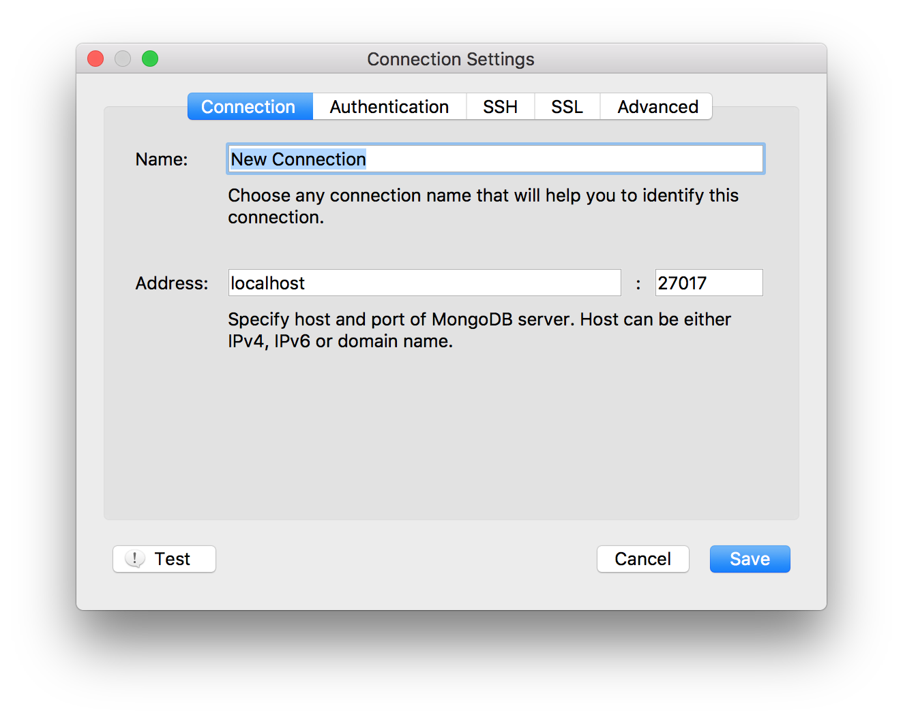
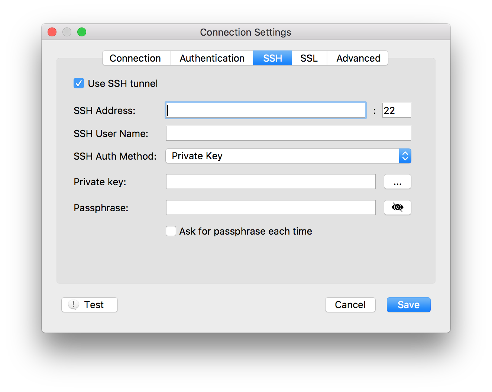
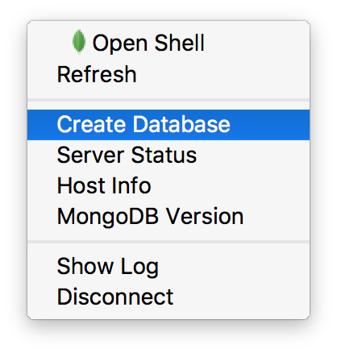
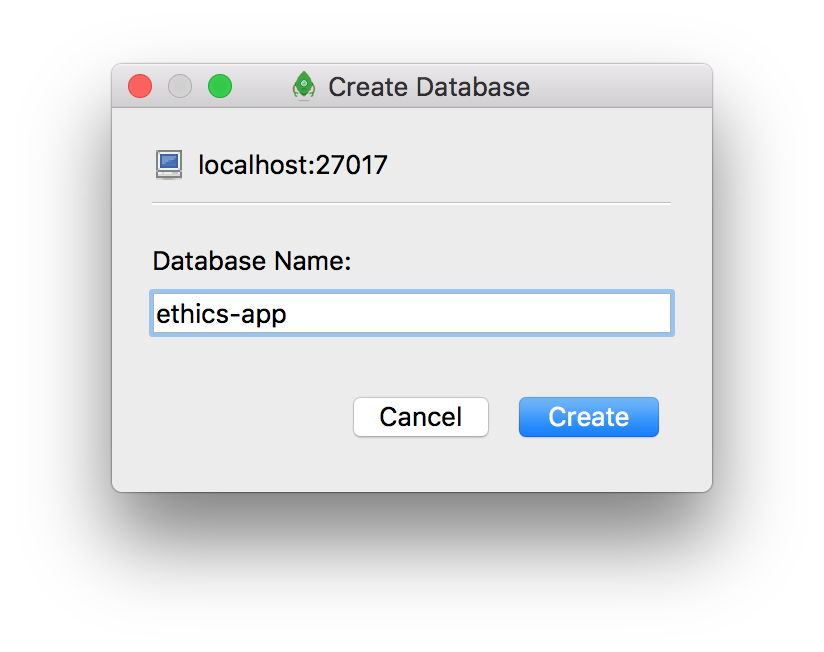
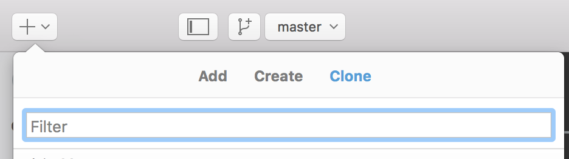

# Ethics-app

Ethics-application for the approval of user-studies


### 1. Requirements

##### 1.1. Install nodejs:

Go to [https://nodejs.org/en/](https://nodejs.org/en/) and download the latest **LTS Version** (currently: `v6.9.2 LTS`). Then install nodejs on your machine.


##### 1.2. Install bower:

Run in your terminal the following command:

```
npm install bower -g
```

##### 1.3. Install MongoDB

Go to [https://www.mongodb.com/](https://www.mongodb.com/) and download the **latest stable community version** (currently: `v3.4.0`). Then install MongoDB on your machine.

**Attention**: If you are on macOS you can use **Homebrew** ([http://brew.sh](http://brew.sh)) to install MongoDB from a terminal. Install the package-manager first and run then the following command:

```
brew install mongodb
```

##### 1.4. Create database instance

* Please make sure, that your MongoDB is running


* Choose one of the following options:

###### 1.4. a) Robomongo

* Open **Robomongo** ([https://robomongo.org](https://robomongo.org)) and connect to your MongoDB:



If you want to connect to a server, you can use SSH-tunneling to be able to reach localhost remotly:



* Create a new database instance by right-clicking on your connection (e.g. `Localhost`) in the left-sidebar: 






###### 1.4. b) Mongo shell

* Open a terminal and connect to the MongoDB shell:

```
mongo
```

* Inside the MongoDB shell, run then the command:

```
use ethics-db
```

### 2. Installation

**Attention: If you want to contribute to this project, please make a FORK on GitHub and send then a PULL-REQUEST with your changes. If you want to run the application, just follow the next steps.**

##### 2.1. Clone the repository

Choose one of the following options:

##### 2.1. a) Cloning with git

Go to [https://git-scm.com](https://git-scm.com) and download and install **Git**. Run then the following command:

```
git clone https://github.com/sitcomlab/Ethics-app.git
```

##### 2.1. b) Cloning with GitHub for Desktop 

* Download and install **GitHub for Desktop** [https://desktop.github.com](https://desktop.github.com) and clone then the  repository:




##### 2.2. Install dependencies:

Open a terminal and execute the following commands inside your local repository-folder (you should see the files: `package.json` and `bower.json`):

```
npm install
```

```
bower install
```

or as root:

```
sudo bower install --allow-root
```

### 3. Run

* Please make sure, that your MongoDB is running, otherwise open a new terminal and start the deamon with the following command:

```
mongod
```

* Start then the application with the following command:

```
node server.js
```

* As the application can send Emails, you have to specify the SMTP-server by flags:

```
node server.js --gmail YOUR-EMAIL-ADDRESS --password YOUR-EMAIL-PASSWORD
```

* **Attention**: Don't forget to change the parameters in the `config/db.js` and  `config/email.js` in the case you are using different ports or a different SMTP-server.